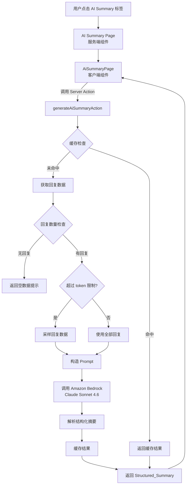
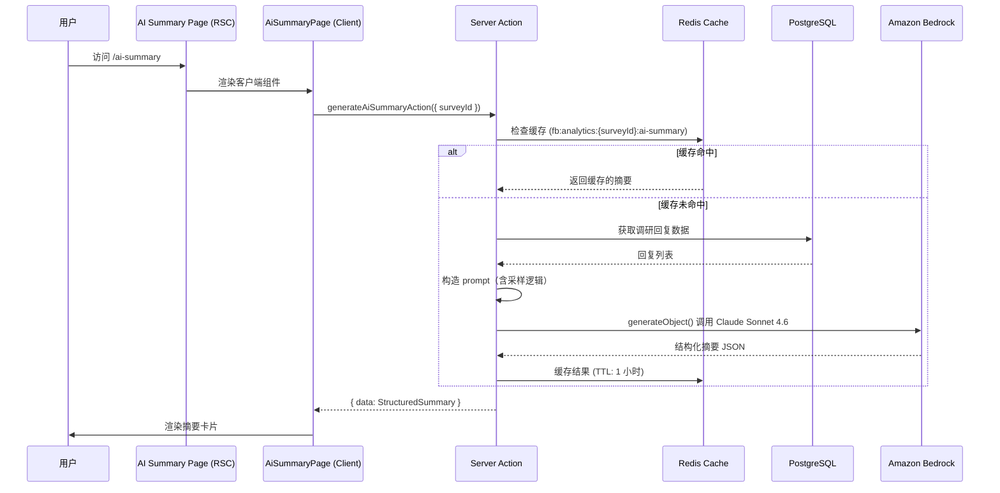

# 设计文档：AI Summary

## 概述

AI Summary 功能为 Formbricks 调研分析模块新增第三个标签页"AI Summary"，利用 Amazon Bedrock Claude Sonnet 4.6 模型对调研回复进行自然语言摘要分析。该功能遵循现有 Summary 和 Responses 页面的架构模式，通过 Server Action 调用 AI 服务，返回包含关键主题、情感分析、关键发现和建议的结构化摘要。

### 设计目标

- 与现有分析页面保持一致的架构模式和用户体验
- 通过缓存机制避免重复的 AI API 调用
- 对大量回复数据进行智能采样以适应模型 token 限制
- 提供清晰的数据隐私通知和错误处理

### 技术选型理由

- **Vercel AI SDK + @ai-sdk/amazon-bedrock**: 项目已使用 Vercel 生态，AI SDK 提供统一的 provider 接口，便于后续切换模型
- **Server Action**: 遵循项目现有的 `authenticatedActionClient` 模式，统一授权和错误处理
- **cache.withCache()**: 遵循项目缓存规范（不使用 `unstable_cache`），基于 Redis 实现

## 架构

### 整体架构图



### 数据流



## 组件与接口

### 组件层级

```
AI Summary Page (服务端组件)
├── PageContentWrapper
│   ├── PageHeader
│   │   ├── SurveyAnalysisNavigation (activeId="ai-summary")
│   │   └── pageTitle={survey.name}
│   └── AiSummaryPage (客户端组件)
│       ├── DataPrivacyNotice (数据隐私通知)
│       ├── LoadingState (加载状态)
│       ├── ErrorState (错误状态 + 重试按钮)
│       ├── EmptyState (无回复空状态)
│       └── SummaryContent
│           ├── AiDisclaimer (AI 生成免责声明)
│           ├── RegenerateButton (重新生成按钮)
│           ├── KeyThemesCard (关键主题卡片)
│           ├── SentimentCard (情感分析卡片)
│           ├── KeyFindingsCard (关键发现卡片)
│           └── RecommendationsCard (建议卡片)
```

### UI 排版示例

以下是 AI Summary 页面的 ASCII 线框图，展示各区域的布局关系：

```
┌─────────────────────────────────────────────────────────────────────┐
│  PageHeader: Survey Name                                            │
│  ┌──────────┐ ┌──────────┐ ┌──────────────┐                        │
│  │ Summary  │ │Responses │ │✨ AI Summary │ ← 激活态               │
│  └──────────┘ └──────────┘ └──────────────┘                        │
├─────────────────────────────────────────────────────────────────────┤
│                                                                     │
│  ┌─ DataPrivacyNotice ────────────────────────────────────────────┐ │
│  │ ⚠ 调研回复数据将被发送到 AWS Bedrock 进行 AI 处理              │ │
│  └────────────────────────────────────────────────────────────────┘ │
│                                                                     │
│  ┌─ AiDisclaimer + RegenerateButton ─────────────────────────────┐ │
│  │ 🤖 以下内容由 AI 生成，仅供参考          [ 🔄 重新生成 ]      │ │
│  └────────────────────────────────────────────────────────────────┘ │
│                                                                     │
│  ┌─ KeyThemesCard ───────────────────────────────────────────────┐ │
│  │ 📋 关键主题                                                    │ │
│  │                                                                │ │
│  │  ● 主题 A — 描述文本...                        (42 条回复)    │ │
│  │  ● 主题 B — 描述文本...                        (28 条回复)    │ │
│  │  ● 主题 C — 描述文本...                        (15 条回复)    │ │
│  └────────────────────────────────────────────────────────────────┘ │
│                                                                     │
│  ┌─ SentimentCard ───────────────────────────────────────────────┐ │
│  │ 😊 情感分析                              整体倾向: 积极       │ │
│  │                                                                │ │
│  │  ██████████████████░░░░░░  积极 65%                            │ │
│  │  ████████░░░░░░░░░░░░░░░  中性 20%                            │ │
│  │  ████░░░░░░░░░░░░░░░░░░░  消极 15%                            │ │
│  │                                                                │ │
│  │  详情: 大多数用户对产品体验表示满意...                         │ │
│  └────────────────────────────────────────────────────────────────┘ │
│                                                                     │
│  ┌─ KeyFindingsCard ─────────────────────────────────────────────┐ │
│  │ 🔍 关键发现                                                    │ │
│  │                                                                │ │
│  │  1. 发现内容...                                                │ │
│  │     📎 证据: "用户原话引用..."                                 │ │
│  │                                                                │ │
│  │  2. 发现内容...                                                │ │
│  │     📎 证据: "用户原话引用..."                                 │ │
│  └────────────────────────────────────────────────────────────────┘ │
│                                                                     │
│  ┌─ RecommendationsCard ─────────────────────────────────────────┐ │
│  │ 💡 建议                                                        │ │
│  │                                                                │ │
│  │  🔴 高优先级: 建议标题                                         │ │
│  │     建议详情描述...                                             │ │
│  │                                                                │ │
│  │  🟡 中优先级: 建议标题                                         │ │
│  │     建议详情描述...                                             │ │
│  │                                                                │ │
│  │  🟢 低优先级: 建议标题                                         │ │
│  │     建议详情描述...                                             │ │
│  └────────────────────────────────────────────────────────────────┘ │
│                                                                     │
│  ┌─ Metadata ────────────────────────────────────────────────────┐ │
│  │ 分析了 128 条回复 · 生成于 2026-03-14 · anthropic.claude-...  │ │
│  └────────────────────────────────────────────────────────────────┘ │
│                                                                     │
└─────────────────────────────────────────────────────────────────────┘
```

**布局说明**：
- 所有卡片采用单列全宽布局，垂直堆叠，与现有 Summary/Responses 页面风格一致
- DataPrivacyNotice 始终显示在最顶部
- AiDisclaimer 和 RegenerateButton 在同一行，左右分布
- 每张卡片使用 `rounded-lg border bg-white p-6 shadow-sm` 样式（复用项目现有卡片风格）
- SentimentCard 中的进度条使用 Tailwind 的 `bg-emerald-500`/`bg-slate-400`/`bg-red-500` 配色
- RecommendationsCard 中的优先级使用红/黄/绿色标识
- Metadata 区域使用较小字号和灰色文本，作为页面底部信息

### 文件结构

```
apps/web/app/(app)/environments/[environmentId]/surveys/[surveyId]/(analysis)/
├── ai-summary/
│   ├── page.tsx                    # 服务端页面组件
│   ├── loading.tsx                 # 加载骨架屏
│   ├── components/
│   │   └── AiSummaryPage.tsx       # 客户端核心 UI 组件
│   └── lib/
│       ├── actions.ts              # Server Action (generateAiSummaryAction)
│       └── ai-summary-service.ts   # AI 摘要生成核心逻辑
├── components/
│   └── SurveyAnalysisNavigation.tsx  # 修改：添加 AI Summary 标签
```

### 接口定义

#### SurveyAnalysisNavigation 修改

在现有 `navigation` 数组中添加第三个项：

```typescript
// Add after "responses" item
{
  id: "ai-summary",
  label: t("common.ai_summary"),
  icon: <SparklesIcon className="h-5 w-5" />,
  href: `${url}/ai-summary?referer=true`,
  current: pathname?.includes("/ai-summary"),
  onClick: () => {
    revalidateSurveyIdPath(environmentId, survey.id);
  },
}
```

#### Server Action 接口

```typescript
// ai-summary/lib/actions.ts
const ZGenerateAiSummaryAction = z.object({
  surveyId: ZId,
  skipCache: z.boolean().optional(), // true when regenerating
});

export const generateAiSummaryAction = authenticatedActionClient
  .inputSchema(ZGenerateAiSummaryAction)
  .action(async ({ ctx, parsedInput }) => {
    // Authorization check
    // Call AI summary service
    // Return { data: TStructuredSummary } or { error: string }
  });
```

#### AI Summary Service 接口

```typescript
// ai-summary/lib/ai-summary-service.ts
export async function generateAiSummary(
  surveyId: string,
  skipCache?: boolean
): Promise<TStructuredSummary>;
```

#### AiSummaryPage 组件 Props

```typescript
interface AiSummaryPageProps {
  surveyId: string;
  environmentId: string;
}
```

## 数据模型

### Structured Summary 类型

```typescript
// Types for the AI-generated structured summary
interface TKeyTheme {
  title: string;        // Theme title
  description: string;  // Theme description
  responseCount: number; // Number of responses related to this theme
}

interface TSentimentAnalysis {
  overall: "positive" | "negative" | "neutral" | "mixed";
  positivePercentage: number;
  negativePercentage: number;
  neutralPercentage: number;
  details: string; // Brief explanation of sentiment distribution
}

interface TKeyFinding {
  finding: string;    // The key finding
  evidence: string;   // Supporting evidence from responses
}

interface TRecommendation {
  title: string;       // Recommendation title
  description: string; // Detailed recommendation
  priority: "high" | "medium" | "low";
}

interface TStructuredSummary {
  keyThemes: TKeyTheme[];
  sentiment: TSentimentAnalysis;
  keyFindings: TKeyFinding[];
  recommendations: TRecommendation[];
  metadata: {
    totalResponsesAnalyzed: number;
    generatedAt: string; // ISO date string
    modelId: string;     // e.g. "anthropic.claude-sonnet-4-6"
  };
}
```

### Zod 验证 Schema

```typescript
const ZKeyTheme = z.object({
  title: z.string(),
  description: z.string(),
  responseCount: z.number().int().nonnegative(),
});

const ZSentimentAnalysis = z.object({
  overall: z.enum(["positive", "negative", "neutral", "mixed"]),
  positivePercentage: z.number().min(0).max(100),
  negativePercentage: z.number().min(0).max(100),
  neutralPercentage: z.number().min(0).max(100),
  details: z.string(),
});

const ZKeyFinding = z.object({
  finding: z.string(),
  evidence: z.string(),
});

const ZRecommendation = z.object({
  title: z.string(),
  description: z.string(),
  priority: z.enum(["high", "medium", "low"]),
});

const ZStructuredSummary = z.object({
  keyThemes: z.array(ZKeyTheme),
  sentiment: ZSentimentAnalysis,
  keyFindings: z.array(ZKeyFinding),
  recommendations: z.array(ZRecommendation),
  metadata: z.object({
    totalResponsesAnalyzed: z.number().int().nonnegative(),
    generatedAt: z.string().datetime(),
    modelId: z.string(),
  }),
});
```

### 缓存策略

- **缓存键**: `createCacheKey.custom("analytics", surveyId, "ai-summary")`
  - 需要先将 `"ai-summary"` 相关的命名空间添加到 `CustomCacheNamespace` 类型中，或复用现有的 `"analytics"` 命名空间
  - 当前 `CustomCacheNamespace` 仅包含 `"analytics"`，可直接复用
- **TTL**: 3600000ms（1 小时），可通过环境变量 `AI_SUMMARY_CACHE_TTL_MS` 配置
- **缓存绕过**: 当用户点击"重新生成"按钮时，`skipCache=true` 参数将绕过缓存读取，但仍会写入新结果

### 环境变量

```env
# AI Summary (Amazon Bedrock)
AWS_BEDROCK_REGION=us-east-1
AWS_ACCESS_KEY_ID=
AWS_SECRET_ACCESS_KEY=
```

这些变量在 `ai-summary-service.ts` 中读取，用于初始化 `@ai-sdk/amazon-bedrock` provider。如果任何必需变量缺失，服务将返回明确的错误消息。

### 回复采样策略

当回复数据总量超过模型 token 限制时（估算阈值：约 500 条回复或序列化后超过 100KB），采用以下采样策略：

1. 按时间均匀采样，确保覆盖调研的不同阶段
2. 优先保留已完成的回复（`finished: true`）
3. 在 prompt 中注明采样比例，让 AI 模型了解数据代表性


## 正确性属性

*属性（Property）是指在系统所有有效执行中都应保持为真的特征或行为——本质上是关于系统应该做什么的形式化声明。属性是人类可读规格与机器可验证正确性保证之间的桥梁。*

以下属性基于需求文档中的验收标准推导而来，每个属性都包含明确的"对于所有"（for all）量化声明。

### Property 1: 导航链接格式正确性

*For any* valid environmentId and surveyId, the AI Summary navigation item's href should equal `/environments/${environmentId}/surveys/${surveyId}/ai-summary?referer=true`.

**Validates: Requirements 1.3**

### Property 2: Prompt 包含完整调研上下文

*For any* survey with a non-empty list of questions and a non-empty list of responses, the constructed prompt string should contain every question's headline text and every included response's data values.

**Validates: Requirements 3.4**

### Property 3: 结构化摘要 Schema 验证

*For any* valid TStructuredSummary object, it must contain a non-empty `keyThemes` array, a `sentiment` object with `overall` being one of ["positive", "negative", "neutral", "mixed"] and percentages summing to approximately 100, a non-empty `keyFindings` array, and a non-empty `recommendations` array with each recommendation having a valid priority.

**Validates: Requirements 3.5**

### Property 4: 缓存键唯一性与格式

*For any* surveyId string, the generated cache key should match the pattern `fb:analytics:{surveyId}:ai-summary` and two different surveyIds should produce different cache keys.

**Validates: Requirements 3.7**

### Property 5: 回复采样保持代表性

*For any* set of responses exceeding the sampling threshold, the sampled subset should have fewer items than the original set, should contain only items from the original set, and should include responses from both the earliest and latest time quartiles of the original data.

**Validates: Requirements 3.8**

### Property 6: AI 错误返回结构化错误

*For any* error thrown during the AI generation process (network error, API error, timeout), the service function should return an object matching `{ error: string }` where the error string is non-empty and descriptive.

**Validates: Requirements 3.9**

### Property 7: 缺失环境变量检测

*For any* subset of the required AWS environment variables (`AWS_BEDROCK_REGION`, `AWS_ACCESS_KEY_ID`, `AWS_SECRET_ACCESS_KEY`) being undefined or empty, the service should return an error that mentions the name(s) of the missing variable(s).

**Validates: Requirements 5.3**

## 错误处理

### 错误场景与处理策略

| 错误场景 | 处理方式 | 用户提示 |
|---------|---------|---------|
| AWS 环境变量缺失 | 服务启动时检测，返回 `{ error }` | "AI 摘要服务未配置，请联系管理员" |
| Amazon Bedrock API 调用失败 | 捕获异常，返回 `{ error }` | "AI 摘要生成失败，请稍后重试" |
| API 超时 | 设置合理的超时时间（30s），超时后返回错误 | "AI 摘要生成超时，请稍后重试" |
| 调研无回复 | 在调用 AI 前检查，直接返回空状态 | "暂无回复数据可供 AI 分析" |
| AI 返回格式异常 | Zod schema 验证失败，返回 `{ error }` | "AI 摘要解析失败，请重试" |
| 用户未授权 | `authenticatedActionClient` 自动处理 | 标准未授权错误 |
| 缓存服务不可用 | `cache.withCache()` 自动降级为直接执行 | 无感知（透明降级） |

### 错误返回格式

遵循项目 Server Action 规范：

```typescript
// Success
return { data: structuredSummary };

// Error
return { error: "Descriptive error message" };
```

## 测试策略

### 双重测试方法

本功能采用单元测试和属性测试相结合的方式，确保全面覆盖。

#### 单元测试（Vitest）

单元测试聚焦于具体示例、边界情况和集成点：

- **ai-summary-service.test.ts**: 测试 AI 摘要服务核心逻辑
  - 无回复时返回空状态消息（边界情况，对应需求 3.10）
  - 环境变量缺失时返回正确错误（对应需求 5.3 的具体示例）
  - 导航数组中 AI Summary 项位于 Responses 之后（对应需求 1.1）
  - activeId="ai-summary" 正确传递（对应需求 2.3）
  - .env.example 包含所需变量（对应需求 5.2）

- **不测试 .tsx 文件**：遵循项目规范，组件由 Playwright E2E 覆盖

#### 属性测试（fast-check）

属性测试使用 `fast-check` 库（TypeScript 生态中最成熟的 PBT 库），验证跨所有输入的通用属性：

- 每个属性测试至少运行 100 次迭代
- 每个测试通过注释引用设计文档中的属性编号
- 标签格式：**Feature: ai-summary, Property {number}: {property_text}**

**属性测试清单**：

1. **Property 1**: 导航链接格式正确性 — 生成随机 environmentId 和 surveyId，验证 href 格式
2. **Property 2**: Prompt 包含完整调研上下文 — 生成随机问题和回复，验证 prompt 包含所有内容
3. **Property 3**: 结构化摘要 Schema 验证 — 生成随机 TStructuredSummary，验证 Zod schema 通过
4. **Property 4**: 缓存键唯一性与格式 — 生成随机 surveyId，验证缓存键格式和唯一性
5. **Property 5**: 回复采样保持代表性 — 生成随机回复列表，验证采样结果的代表性
6. **Property 6**: AI 错误返回结构化错误 — 生成随机错误类型，验证返回格式
7. **Property 7**: 缺失环境变量检测 — 生成随机缺失变量组合，验证错误消息

**测试文件位置**：

```
apps/web/app/(app)/environments/[environmentId]/surveys/[surveyId]/(analysis)/ai-summary/lib/
├── ai-summary-service.test.ts       # 单元测试 + 属性测试
```
