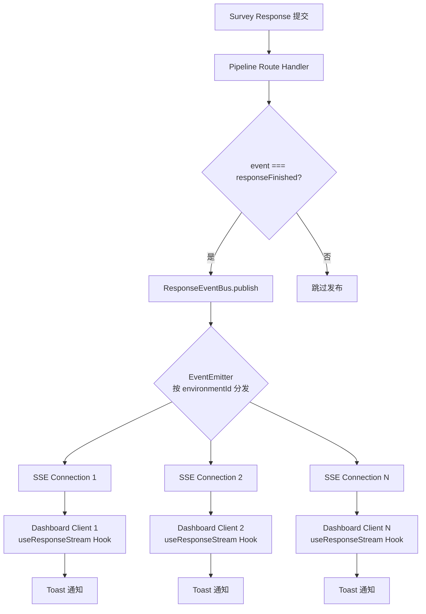
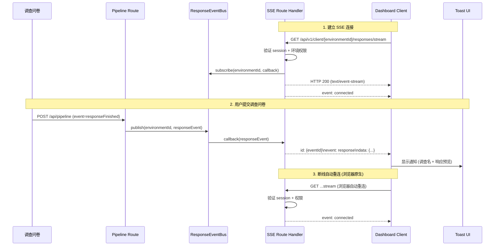

# 设计文档：实时响应通知流 (Response Notification Stream)

## 概述

本功能为 Formbricks 仪表盘构建基于 Server-Sent Events (SSE) 的实时通知系统。当用户提交调查问卷（`responseFinished`）时，系统自动将通知推送到已订阅该环境的仪表盘用户，无需刷新页面。

核心设计采用内存级 pub/sub（EventEmitter）作为 MVP 方案，通过可替换的 `ResponseEventBus` 接口抽象事件总线，便于后续切换到 Redis pub/sub。SSE 端点通过 Next.js Route Handler 实现，客户端通过 `useResponseStream` React Hook 消费事件流，并在仪表盘中以 toast 通知形式展示新响应。

### 设计目标

- 零刷新体验：新响应提交后自动推送通知到仪表盘
- 环境隔离：严格按 `environmentId` 隔离通知，符合多租户架构
- 可替换的事件总线：MVP 使用 EventEmitter，接口设计支持无缝切换到 Redis pub/sub
- 安全性：SSE 端点验证 next-auth 会话并检查环境访问权限
- 简洁性：依赖浏览器原生 EventSource 自动重连，无需自定义重连逻辑

### 技术选型理由

- **SSE over WebSocket**: 单向推送场景，SSE 更轻量，无需额外服务器，Next.js Route Handler 原生支持
- **EventEmitter**: Node.js 内置，零依赖，MVP 阶段足够，通过接口抽象可替换
- **react-hot-toast**: 项目已全局使用，无需引入新 UI 库
- **浏览器原生重连**: EventSource 内置自动重连机制，无需自定义指数退避逻辑

## 架构

### 整体架构图



### 数据流时序图



## 组件与接口

### 文件结构

```
modules/response-notification/
├── lib/
│   ├── response-event-bus.ts        # 事件总线接口 + EventEmitter 实现
│   ├── response-event-bus.test.ts   # 事件总线单元测试
│   └── types.ts                     # 类型定义
├── hooks/
│   └── useResponseStream.ts         # React Hook (SSE 客户端)
└── components/
    └── ResponseNotificationProvider.tsx  # 通知 Provider 组件

apps/web/app/api/v1/client/[environmentId]/responses/stream/
└── route.ts                         # SSE Route Handler
```

### 组件 1: ResponseEventBus（事件总线）

**用途**: 抽象事件发布/订阅机制，解耦 Pipeline 与 SSE 连接

**接口**:

```typescript
// modules/response-notification/lib/types.ts

import { TResponse } from "@formbricks/types/responses";

export interface TResponseEvent {
  id: string;           // Unique event ID (uuidv7 for ordering)
  environmentId: string;
  surveyId: string;
  surveyName: string;
  event: "responseFinished";
  response: Pick<TResponse, "id" | "createdAt" | "data" | "finished">;
  timestamp: Date;
}

export type TResponseEventCallback = (event: TResponseEvent) => void;

export interface IResponseEventBus {
  publish(event: TResponseEvent): void;
  subscribe(environmentId: string, callback: TResponseEventCallback): () => void;
  getSubscriberCount(environmentId: string): number;
}
```

```typescript
// modules/response-notification/lib/response-event-bus.ts

import { EventEmitter } from "events";
import { IResponseEventBus, TResponseEvent, TResponseEventCallback } from "./types";

class EventEmitterBus implements IResponseEventBus {
  private emitter = new EventEmitter();

  constructor() {
    // Support up to 100 concurrent listeners per environment
    this.emitter.setMaxListeners(0);
  }

  publish(event: TResponseEvent): void {
    this.emitter.emit(`response:${event.environmentId}`, event);
  }

  subscribe(environmentId: string, callback: TResponseEventCallback): () => void {
    const channel = `response:${environmentId}`;
    this.emitter.on(channel, callback);
    return () => {
      this.emitter.off(channel, callback);
    };
  }

  getSubscriberCount(environmentId: string): number {
    return this.emitter.listenerCount(`response:${environmentId}`);
  }
}

// Singleton instance — replaceable with Redis pub/sub later
export const responseEventBus: IResponseEventBus = new EventEmitterBus();
```

**职责**:
- 按 `environmentId` 隔离事件通道
- 提供 publish/subscribe/unsubscribe 语义
- 返回取消订阅函数，便于清理
- 通过 `IResponseEventBus` 接口抽象，后续可替换为 Redis 实现

### 组件 2: SSE Route Handler

**用途**: 提供 SSE 端点，验证身份后建立长连接，推送事件流。无心跳机制，依赖浏览器原生 EventSource 自动重连。

**接口**:

```typescript
// apps/web/app/api/v1/client/[environmentId]/responses/stream/route.ts

import { getServerSession } from "next-auth";
import { v7 as uuidv7 } from "uuid";
import { authOptions } from "@/modules/auth/lib/authOptions";
import { hasUserEnvironmentAccess } from "@/lib/environment/auth";
import { responseEventBus } from "@/modules/response-notification/lib/response-event-bus";
import { TResponseEvent } from "@/modules/response-notification/lib/types";

export const dynamic = "force-dynamic";

export async function GET(
  request: Request,
  { params }: { params: Promise<{ environmentId: string }> }
): Promise<Response> {
  const { environmentId } = await params;

  // 1. Authenticate session
  const session = await getServerSession(authOptions);
  if (!session?.user?.id) {
    return new Response("Unauthorized", { status: 401 });
  }

  // 2. Authorize environment access
  const hasAccess = await hasUserEnvironmentAccess(session.user.id, environmentId);
  if (!hasAccess) {
    return new Response("Forbidden", { status: 403 });
  }

  // 3. Create SSE stream
  const stream = new ReadableStream({
    start(controller) {
      const encoder = new TextEncoder();

      const send = (eventType: string, data: unknown, id?: string) => {
        try {
          const eventId = id ?? uuidv7();
          const payload =
            `id: ${eventId}\n` +
            `event: ${eventType}\n` +
            `data: ${JSON.stringify(data)}\n\n`;
          controller.enqueue(encoder.encode(payload));
        } catch {
          // Connection closed, ignore
        }
      };

      // Send initial connected event
      send("connected", { environmentId, timestamp: new Date().toISOString() });

      // Subscribe to response events
      const unsubscribe = responseEventBus.subscribe(environmentId, (event: TResponseEvent) => {
        send("response", {
          id: event.id,
          surveyId: event.surveyId,
          surveyName: event.surveyName,
          event: event.event,
          responseId: event.response.id,
          responseData: event.response.data,
          finished: event.response.finished,
          createdAt: event.response.createdAt,
        }, event.id);
      });

      // Cleanup on close
      request.signal.addEventListener("abort", () => {
        unsubscribe();
        try {
          controller.close();
        } catch {
          // Already closed
        }
      });
    },
  });

  return new Response(stream, {
    headers: {
      "Content-Type": "text/event-stream",
      "Cache-Control": "no-cache, no-transform",
      Connection: "keep-alive",
      "X-Accel-Buffering": "no",
    },
  });
}
```

**前置条件**:
- 请求必须包含有效的 next-auth session
- 用户必须对 `environmentId` 所属项目拥有访问权限

**后置条件**:
- 返回 `text/event-stream` 响应
- 连接关闭时自动取消订阅

### 组件 3: useResponseStream Hook

**用途**: 客户端 React Hook，管理 SSE 连接生命周期，提供事件数据。依赖浏览器原生 EventSource 自动重连。

**接口**:

```typescript
// modules/response-notification/hooks/useResponseStream.ts

"use client";

import { useEffect, useRef, useState } from "react";
import { TStreamEvent } from "../lib/types";

export const useResponseStream = (environmentId: string): { lastEvent: TStreamEvent | null } => {
  const [lastEvent, setLastEvent] = useState<TStreamEvent | null>(null);
  const eventSourceRef = useRef<EventSource | null>(null);

  useEffect(() => {
    const url = new URL(
      `/api/v1/client/${environmentId}/responses/stream`,
      window.location.origin
    );

    const eventSource = new EventSource(url.toString());
    eventSourceRef.current = eventSource;

    eventSource.addEventListener("response", (e: MessageEvent) => {
      const data = JSON.parse(e.data) as TStreamEvent;
      setLastEvent(data);
    });

    return () => {
      eventSource.close();
    };
  }, [environmentId]);

  return { lastEvent };
};
```

**职责**:
- 建立和管理 EventSource 连接
- 浏览器原生自动重连（无需自定义逻辑）
- 组件卸载时优雅关闭连接
- 暴露 `lastEvent`

### 组件 4: ResponseNotificationProvider

**用途**: 在仪表盘布局中监听 SSE 事件并显示 toast 通知

```typescript
// modules/response-notification/components/ResponseNotificationProvider.tsx

"use client";

import { useEffect } from "react";
import toast from "react-hot-toast";
import { useTranslation } from "react-i18next";
import { useResponseStream } from "../hooks/useResponseStream";
import { formatResponsePreview } from "../lib/types";

interface ResponseNotificationProviderProps {
  environmentId: string;
}

export const ResponseNotificationProvider = ({ environmentId }: ResponseNotificationProviderProps) => {
  const { lastEvent } = useResponseStream(environmentId);
  const { t } = useTranslation();

  useEffect(() => {
    if (!lastEvent) return;

    const preview = formatResponsePreview(lastEvent.responseData);
    const message = `${lastEvent.surveyName}: ${preview}`;

    toast.success(
      t("environments.surveys.responses.new_response_notification", message),
      { duration: 5000 }
    );
  }, [lastEvent, t]);

  return null; // Render nothing — side-effect only component
};
```

## 数据模型

### SSE 事件格式

SSE 端点发送两种事件类型：

| 事件类型 | 触发条件 | 数据格式 |
|---------|---------|---------|
| `connected` | 连接建立成功 | `{ environmentId, timestamp }` |
| `response` | 新响应提交完成 | `TStreamEvent` (见下方) |

### TResponseEvent（服务端事件）

```typescript
interface TResponseEvent {
  id: string;           // uuidv7, sortable
  environmentId: string;
  surveyId: string;
  surveyName: string;
  event: "responseFinished";
  response: Pick<TResponse, "id" | "createdAt" | "data" | "finished">;
  timestamp: Date;
}
```

### TStreamEvent（客户端事件）

```typescript
interface TStreamEvent {
  id: string;
  surveyId: string;
  surveyName: string;
  event: "responseFinished";
  responseId: string;
  responseData: Record<string, string | number | string[]>;
  finished: boolean;
  createdAt: string;
}
```

### Pipeline 集成点

在 `apps/web/app/api/(internal)/pipeline/route.ts` 的 `POST` 处理函数中，仅在 `event === "responseFinished"` 时发布事件：

```typescript
// Only publish on responseFinished (not responseCreated)
if (event === "responseFinished") {
  try {
    responseEventBus.publish({
      id: uuidv7(),
      environmentId,
      surveyId,
      surveyName: survey.name,
      event,
      response: {
        id: response.id,
        createdAt: response.createdAt,
        data: response.data,
        finished: response.finished ?? false,
      },
      timestamp: new Date(),
    });
  } catch (error) {
    logger.error({ error }, "Failed to publish response event to SSE bus");
  }
}
```

## 关键函数的形式化规格

### 函数 1: `ResponseEventBus.publish(event)`

```typescript
function publish(event: TResponseEvent): void
```

**前置条件**:
- `event.environmentId` 是非空字符串
- `event.id` 是有效的 UUIDv7
- `event.response` 包含必需字段

**后置条件**:
- 所有订阅了 `event.environmentId` 的回调函数被同步调用
- 未订阅该 `environmentId` 的回调不会被调用
- 发布操作不抛出异常（即使没有订阅者）

**循环不变量**: 不适用

### 函数 2: `ResponseEventBus.subscribe(environmentId, callback)`

```typescript
function subscribe(environmentId: string, callback: TResponseEventCallback): () => void
```

**前置条件**:
- `environmentId` 是非空字符串
- `callback` 是有效函数

**后置条件**:
- 返回一个取消订阅函数
- 调用取消订阅函数后，`callback` 不再接收该 `environmentId` 的事件
- `getSubscriberCount(environmentId)` 增加 1
- 取消订阅后 `getSubscriberCount(environmentId)` 减少 1

**循环不变量**: 不适用

### 函数 3: SSE `GET` Handler

```typescript
async function GET(request: Request, { params }): Promise<Response>
```

**前置条件**:
- `request` 是有效的 HTTP GET 请求
- `params.environmentId` 是有效的环境 ID

**后置条件**:
- 无有效 session → 返回 HTTP 401
- 有 session 但无环境权限 → 返回 HTTP 403
- 认证通过 → 返回 HTTP 200，Content-Type 为 `text/event-stream`
- 连接关闭时，事件总线订阅被清理

**循环不变量**: 不适用

### 函数 4: `useResponseStream(environmentId)`

```typescript
function useResponseStream(environmentId: string): { lastEvent: TStreamEvent | null }
```

**前置条件**:
- `environmentId` 是非空字符串
- 在 React 组件树中调用

**后置条件**:
- 组件卸载时 EventSource 被关闭
- 每次收到 `response` 事件时 `lastEvent` 更新
- 断线重连由浏览器原生 EventSource 机制处理

**循环不变量**: 不适用

### 函数 5: `formatResponsePreview(data)`

```typescript
function formatResponsePreview(data: Record<string, string | number | string[]>): string
```

**前置条件**:
- `data` 是有效的 Record 对象（可以为空）

**后置条件**:
- 空 data → 返回空字符串
- 非空 data → 返回第一个值的字符串表示，截断至 80 字符
- 返回值长度 ≤ 83（80 + "..." 的 3 个字符）

**循环不变量**: 不适用

## 算法伪代码

### SSE 连接生命周期算法

```pascal
ALGORITHM sseConnectionLifecycle(request, environmentId)
INPUT: request: HTTP Request, environmentId: string
OUTPUT: SSE Response stream

BEGIN
  // Step 1: Authentication
  session ← getServerSession(authOptions)
  IF session IS NULL OR session.user.id IS NULL THEN
    RETURN HTTP 401 "Unauthorized"
  END IF

  // Step 2: Authorization
  hasAccess ← hasUserEnvironmentAccess(session.user.id, environmentId)
  IF NOT hasAccess THEN
    RETURN HTTP 403 "Forbidden"
  END IF

  // Step 3: Create stream
  stream ← new ReadableStream()

  // Step 4: Send connected event
  send("connected", { environmentId, timestamp: now() })

  // Step 5: Subscribe to event bus
  unsubscribe ← responseEventBus.subscribe(environmentId, (event) =>
    send("response", serializeEvent(event), event.id)
  )

  // Step 6: Cleanup on abort
  ON request.signal.abort DO
    unsubscribe()
    stream.close()
  END ON

  RETURN Response(stream, headers: { "Content-Type": "text/event-stream" })
END
```

## 示例用法

### 在仪表盘布局中集成

```typescript
// apps/web/app/(app)/environments/[environmentId]/layout.tsx

import { ResponseNotificationProvider } from "@/modules/response-notification/components/ResponseNotificationProvider";

export default async function EnvironmentLayout({
  children,
  params,
}: {
  children: React.ReactNode;
  params: Promise<{ environmentId: string }>;
}) {
  const { environmentId } = await params;

  return (
    <>
      <ResponseNotificationProvider environmentId={environmentId} />
      {children}
    </>
  );
}
```

### Pipeline 中发布事件

```typescript
// In apps/web/app/api/(internal)/pipeline/route.ts
// Only publish on responseFinished

if (event === "responseFinished") {
  try {
    responseEventBus.publish({
      id: uuidv7(),
      environmentId,
      surveyId,
      surveyName: survey.name,
      event,
      response: {
        id: response.id,
        createdAt: response.createdAt,
        data: response.data,
        finished: response.finished ?? false,
      },
      timestamp: new Date(),
    });
  } catch (error) {
    logger.error({ error }, "Failed to publish response event to SSE bus");
  }
}
```

## 正确性属性

### Property 1: 环境隔离性

*For any* two distinct environmentIds `envA` and `envB`, publishing an event with `environmentId = envA` must invoke all and only the callbacks subscribed to `envA`, and must not invoke any callback subscribed to `envB`.

**Validates: Requirements 1.1, 1.2**

### Property 2: 订阅生命周期一致性

*For any* sequence of subscribe and unsubscribe operations on a given `environmentId`, `getSubscriberCount(environmentId)` must equal the number of active (not yet unsubscribed) subscriptions for that environment. After unsubscribe, the callback must not receive any further events for that environment.

**Validates: Requirements 1.5, 1.6**

### Property 3: 取消订阅幂等性

*For any* subscription, calling the returned unsubscribe function multiple times must not throw an error and must not affect other subscriptions. After the first call, the callback must not receive any further events.

**Validates: Requirement 1.7**

### Property 4: 响应预览截断

*For any* input to `formatResponsePreview`, the returned string length must be ≤ 83 characters (80 content + 3 for "..."). Empty input must return an empty string.

**Validates: Requirements 6.1, 6.4**

### Property 5: 响应预览格式化正确性

*For any* non-empty response data record, `formatResponsePreview` must return a string representation of the first field's value. When the first field's value is an array, the elements must be joined with `", "`.

**Validates: Requirements 6.2, 6.3**

## 错误处理

### 错误场景与处理策略

| 错误场景 | 处理方式 | 用户影响 |
|---------|---------|---------|
| 未认证请求 | 返回 HTTP 401 | EventSource 触发 error，浏览器自动重连 |
| 无环境权限 | 返回 HTTP 403 | EventSource 触发 error，浏览器自动重连 |
| SSE 连接断开 | 浏览器原生 EventSource 自动重连 | 短暂无通知，自动恢复 |
| Pipeline 发布失败 | try-catch 捕获，记录日志 | 不影响 Pipeline 主流程 |
| EventSource 不支持 | 浏览器兼容性检查 | 降级为无实时通知 |
| 服务器重启 | 所有连接断开，浏览器自动重连 | 短暂中断后恢复 |

### 关键设计决策

1. **仅在 responseFinished 时发布**: Pipeline 中仅在用户完成提交时发布事件，`responseCreated` 不触发通知，减少噪音。

2. **事件发布是 fire-and-forget**: Pipeline 中的 `responseEventBus.publish()` 不应阻塞或影响主流程。即使发布失败，Pipeline 的其他处理（webhook、邮件等）仍正常执行。

3. **SSE 端点不做事件持久化**: MVP 阶段不存储历史事件。`Last-Event-ID` 仅用于浏览器原生重连机制，服务端不回放历史事件。

4. **无心跳机制**: 简化实现，依赖浏览器原生 EventSource 自动重连。如果代理超时断开连接，浏览器会自动重新建立连接。

5. **无自定义重连逻辑**: 移除指数退避、重试计数等复杂逻辑，完全依赖浏览器内置的 EventSource 重连机制。

## 测试策略

### 单元测试（Vitest）

- **response-event-bus.test.ts**: 测试事件总线核心逻辑
  - publish 到无订阅者的环境不抛异常
  - subscribe 后 publish 触发回调
  - unsubscribe 后不再收到事件
  - 多环境隔离：envA 的事件不触发 envB 的回调
  - getSubscriberCount 正确反映订阅数

- **types.test.ts**: 测试类型和辅助函数
  - formatResponsePreview 截断逻辑
  - 空数据返回空字符串
  - 数组值正确 join

- **不测试 .tsx 文件**: 遵循项目规范

### 属性测试（fast-check）

属性测试使用 `fast-check` 库验证跨所有输入的通用属性：

1. **Property 1**: 环境隔离性 — 生成随机 environmentId 对，验证事件不跨环境泄漏
2. **Property 2**: 订阅生命周期一致性 — 生成随机 subscribe/unsubscribe 序列，验证计数和回调行为
3. **Property 3**: 取消订阅幂等性 — 多次调用 unsubscribe，验证无异常
4. **Property 4**: 响应预览截断 — 生成随机字符串，验证长度约束
5. **Property 5**: 响应预览格式化正确性 — 生成随机响应数据，验证格式化行为

### 集成测试要点

- Pipeline POST → EventBus publish → SSE 推送的端到端流程
- 认证/授权拒绝场景
- 并发连接压力测试（50 连接/环境）

## 性能考量

- **内存占用**: EventEmitter 每个监听器约 ~100 bytes，50 连接/环境 × 100 环境 = ~500KB，可忽略
- **事件分发延迟**: EventEmitter 同步分发，微秒级
- **SSE 连接数**: Node.js 默认支持数千并发连接，50/环境远在安全范围内
- **Pipeline 影响**: `publish()` 是同步操作，不增加 Pipeline 响应时间

## 安全考量

- **认证**: SSE 端点通过 `getServerSession(authOptions)` 验证 next-auth 会话
- **授权**: 通过 `hasUserEnvironmentAccess` 确认用户对环境的访问权限（owner/manager/billing 或 team 成员）
- **数据最小化**: SSE 事件只包含响应 ID、调查名称和响应数据预览，不包含敏感的用户信息
- **无 CORS**: SSE 端点仅供同源仪表盘使用，不设置 CORS 头
- **连接限制**: EventEmitter `setMaxListeners(0)` 移除警告，但生产环境应考虑添加每环境连接数上限

## 依赖

- **现有依赖（无需新增）**:
  - `next-auth` — 会话验证
  - `uuid` (v7) — 有序事件 ID
  - `react-hot-toast` — Toast 通知
  - `react-i18next` — 国际化
  - `@formbricks/logger` — 日志
  - Node.js `events` 模块 — EventEmitter

- **无新增外部依赖**
